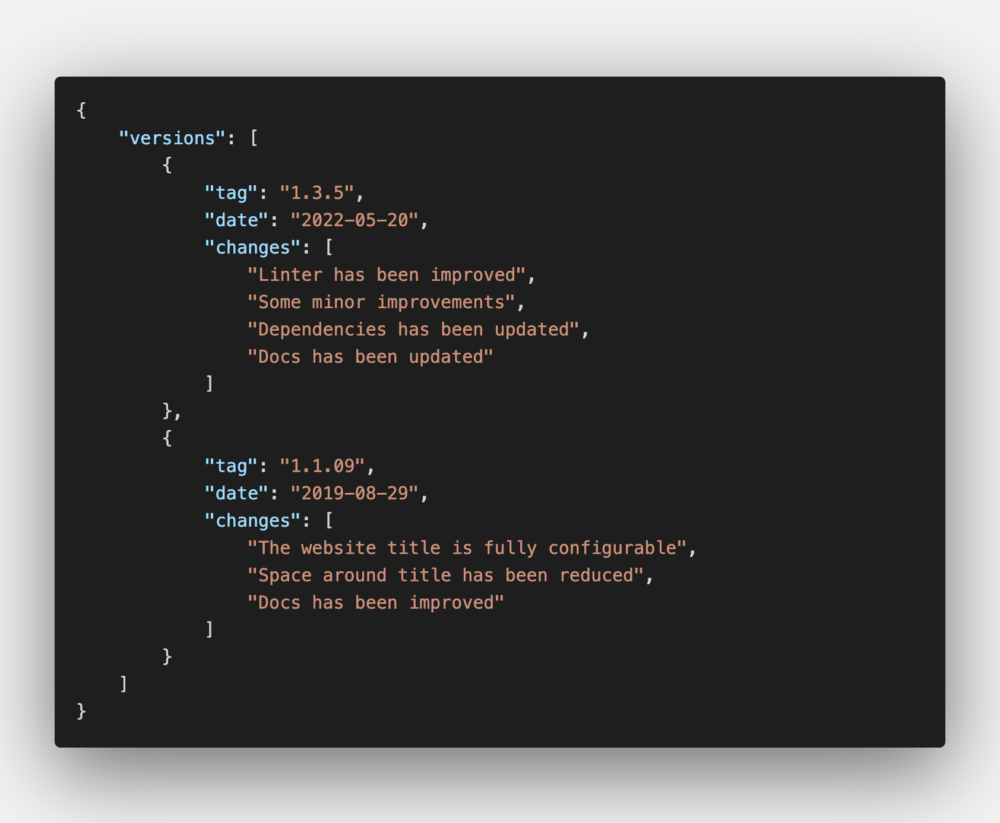

# Changelog-generator ⚡️

**A template for building static websites with the purpose of creating quick and easy changelogs!**  

This project is a simple way to create and maintain a changelog.  

 

## ✨ Features

* **Without Coding!** You don't need to code anything. Only edit two JSON files
* **No tied to language.** You can edit all text of website, so this repo doesn't force you to use any language
* **Create a static website so fast.** You only need a couple of minutes
* **Easy PDF creation.** Compatible with the browser's PDF print function
* **Multipurpose.** Do changelogs, roadmaps or just TO DO lists!


## 🔨 How to use

### ⚠️ Requirements
This project requires [Node.js](https://nodejs.org) 16 or higher installed on your computer.
Clone or download this repository and then install the dependencies: `npm install`.  


### 📝 Configuration and changelog data entry

All configuration and data is obtained from JSON files. 
To add data that will be part of the changelog you must edit the file located in the directory `data/changelog.json`.  

 

```
💡 TIP! 

If you need to update the changelog data frequently, you should consider automating 
the generation of the changelog.json file.
```

You should also edit the configuration file located in the directory `data/configuration.json`.  

 

**Parameters to configure:** 
* `languageOfWebsite` => Set the language of website content (optional). Examples: `es` for spanish, or `en` for english.
* `titleOfWebsite` => Set the page title (optional)
* `limitOfVersionsToShow` => Set the number of versions to be displayed (starting at the top of JSON file. Default value is 10)
* `textOfListHeader` => Set the title of the lists (optional)
* `footerUrlLink` => Establish the link to indicate the authorship of the project (optional, but don't forget to set the property `footerTextLink` if you set a value)
* `footerTextLink` => Establish the text of the link to indicate the authorship of the project (optional, but don't forget to set the property `footerUrlLink` if you set a value)

You can run the command `npm run dev` to view the changes in live on `http://localhost:3000`.

After edit both JSON files, you are ready to publish your website.


### 🚀 Publish
Execute the comand `npm run publish`. Then a directory called `/out` will be created. Move all content of that folder to your web server. 
Of course, you can publish the website generated on GitHub Pages, Surge, Netlify or similar services.


```
💡 TIP! 

If you would generate a PDF file with your changelog, you can run the command: 
`npm run build && npm run start`. 
Then navigate to `http://localhost:3000` and use the the browser's PDF print function 
to generate the PDF file.
```


### 🌀 Development
This project is made with [Next.js](https://nextjs.org) and [Bootstrap 4](https://getbootstrap.com).  

**Some useful commands:**  
* Run the project with 'watch' option: `npm run dev`.    
* Run a basic linter: `npm run lint`.   

### 🐛 Issues, pull request or suggestions
Feel free to open an issue to ask anything or even open a pull request to collaborate

