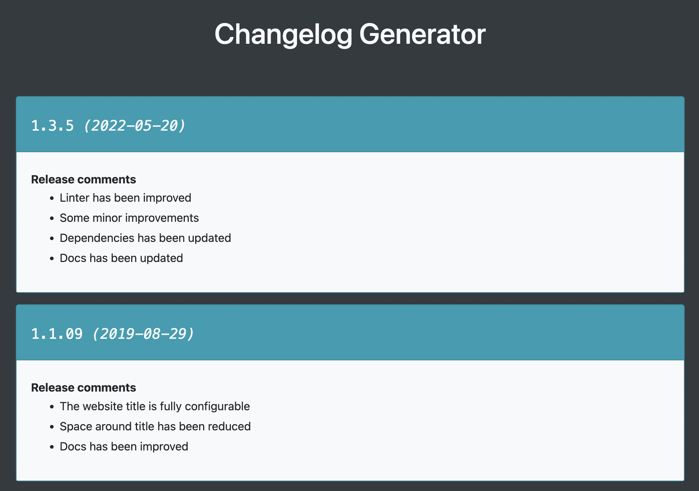
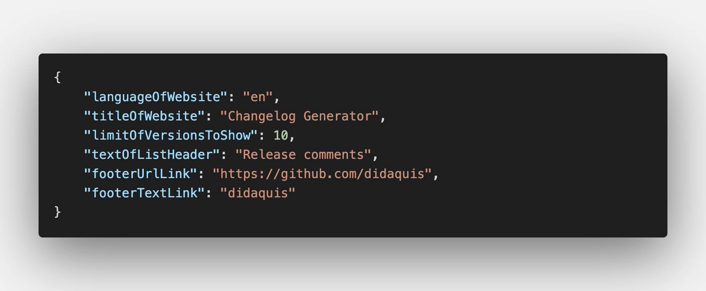

# Changelog-generator ⚡️

**This is a project made to create easy and fast changelogs.**

 

## ✨ Features

* **Without Coding!** You don't need to code anything. Only edit two JSON files
* **No tied to languaje** You can edit all text of websites, so this repo don't force you to use any language
* **Create an static website so fast** You only need a couple of minutes
* **Easy PDF creation** Compatible with the browser's PDF print function


## 🔨 How to use

### ⚠️ Requirements
This project require [Node.js](https://nodejs.org) installed on your computer.
Clone or download this repository and then install the dependencies: `npm install`.  


### 📝 Configuration and changelog data entry

All configuration and data is obtained from JSON files. 
To add data that will be part of the changelog you must edit the file located in the directory `data/changelog.json`.  

 

```
💡 TIP! 

If you need to update the changelog data frequently, you should consider automating the generation 
of the changelog.json file.
```

You should also edit the configuration file located in the directory `data/configuration.json`.  

 

You can run the command `npm run dev` to view the changes in live on `http://localhost:3000`.

After edit both JSON files, you are ready to publish.


### 🚀 Publish
Execute the comand `npm run publish`. Then a directory called `/out` will be created. Move all content of that folder to your web server. 
Of course, you can publish the website generated on GitHub Pages, Surge or similar services.


```
💡 TIP! 

If you would generate a PDF file with your changelog, you can run the command: 
`npm run build && npm run start`. 
Then navigate to `http://localhost:3000` and use the the browser's PDF print function 
to generate the PDF file.
```


### 🌀 Developing
This project is made with [Next.js](https://nextjs.org) and [Bootstrap 4](https://getbootstrap.com).  

**Some useful commands:**  
* Run the project with 'watch' option: `npm run dev`.    
* Run a basic linter: `npm run lint`.   

### 🐛 Issues, pull request or suggestions
Feel free to open an issue to ask anything or even open a pull request to collaborate

